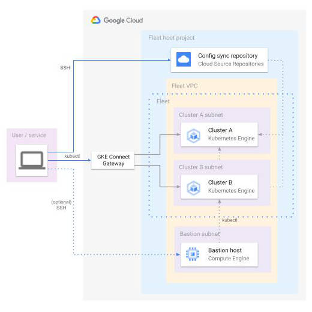

# Terraform code for Anthos Connect Gateway demo

The code provisions required infrastructure for Anthos Connect Gateway demo.

The infrastructure consists of N private GKE clusters that are registered fleet members.
The fleet uses Config Sync with a GIT repository provided by Source Code Repositories.

Optionally, a bastion host with a public IP address can be provisioned in the same VPC network for
troubleshooting purposes.



## Example configuration

```hcl
project_id           = "my-project-id"
clusters = {
  cluster-a = {
    subnet        = "clustera"
    ip_range_base = "10.1.0.0/16"
    region        = "europe-west2"
  }
  cluster-b = {
    subnet        = "clusterb"
    ip_range_base = "10.2.0.0/16"
    region        = "europe-west2"
  }
}
```

## Variables

| name | description | type | required | default |
|---|---|:---:|:---:|:---:|
| `project_id` | Identifier of a project for hosting GKE clusters fleet. | `string` | ✓ | |
| `clusters` | The object with clusters definitions. Each entry is a cluster name with subnet, ip_range_base and region attributes. | `map(map(string))` | ✓ | |
| `gke_connect_agent_users` | List of Google Accounts to configure GKE Connect Gateway Access for. | `list(string)` |  | `[]` |
| `bastion_enabled` | Flag that determines provisioning of bastion VM instance. | `bool` | | `false` |
| `bastion_subnet_ip_range` | IP range for test subnet. | `string` | | `172.16.1.0/24` |
| `bastion_subnet_region` | GCP region for test subnet and VM. |  `string` | | `europe-west2` |

## Outputs

| name | description | sensitive |
|---|---|:---:|
| `clusters` | List of provisioned GKE cluster identifiers. |  |
| `acm_repo_url` | URL of Anthos Config Management repository for provisioned GKE Fleet. |  |
